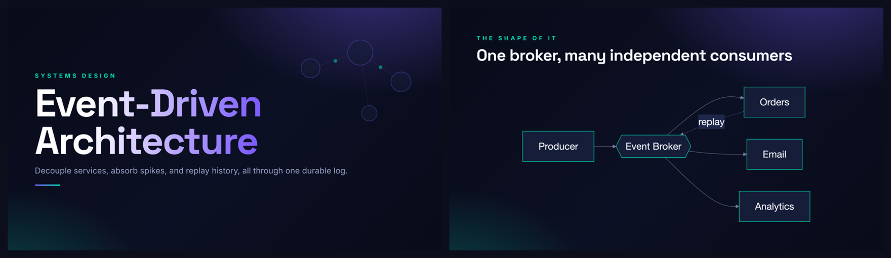
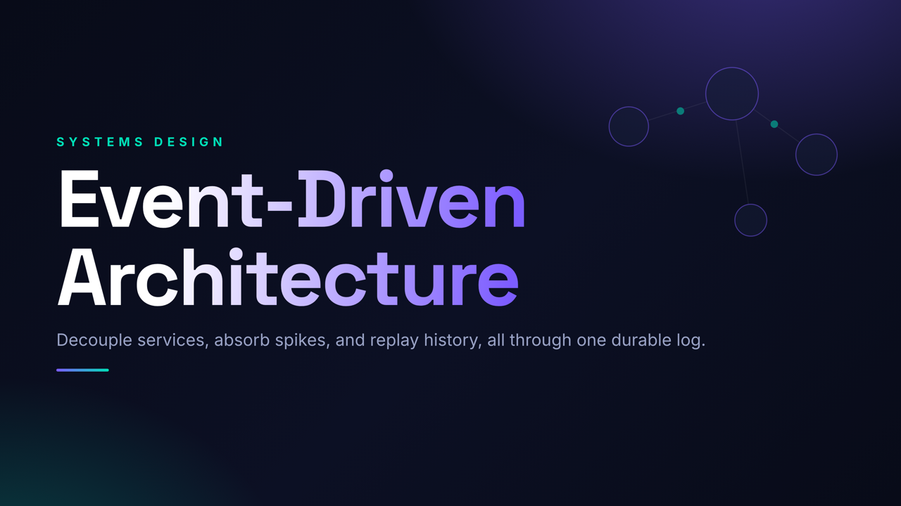
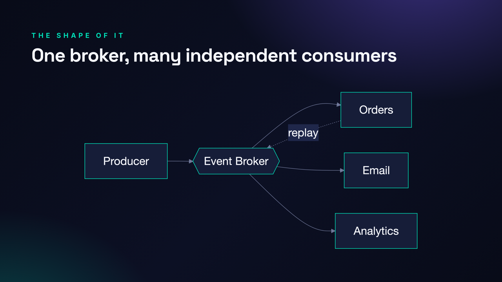
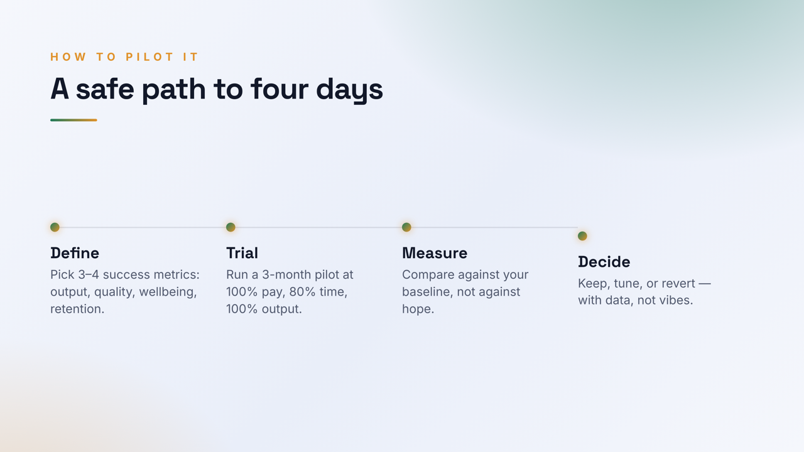
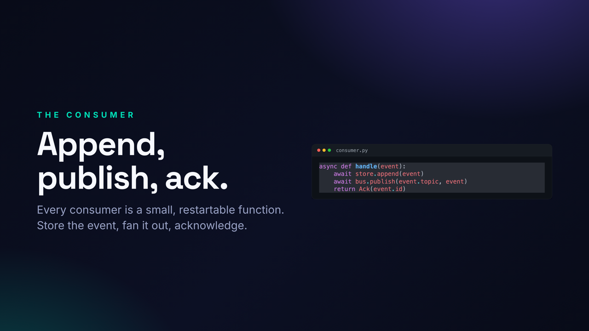

# PitchCraft

Turn a topic or a URL into a visually striking, story-first presentation. Real `.pptx` plus PDF, not generic AI bullet slides.

PitchCraft writes a narrative first, then designs each slide for its moment. It can pull the real diagrams, screenshots, and code from a source page, generate architecture diagrams, theme dark or light or your brand, and check its own output for slop, missing citations, and overflow. It also ships an editable companion deck for when you need to change text in PowerPoint.

Built as a Claude Code plugin. You drive it with `/deck <topic or url>`.



## What the slides look like

| | |
|:--:|:--:|
|  |  |
| Title, dark theme | Generated architecture diagram |
|  |  |
| Stat grid, light theme | Process timeline |
|  |  |
| Syntax-highlighted code | Title, light theme |

## Install in Claude Code

```text
/plugin marketplace add fnusatvik07/pitchcraft
/plugin install pitchcraft@pitchcraft
```

Then build a deck:

```text
/deck https://docs.example.com/some-guide
/deck "the economics of solar power" --light
/deck "Q3 strategy review" --slides 12
```

The first run installs the local runtime for you (a Python virtualenv, a headless browser, and a small Node helper). You get `out/<Deck>.pptx`, `out/<Deck>.pdf`, and on request `out/<Deck>_Editable.pptx`.

## Install standalone (any terminal)

```bash
git clone https://github.com/fnusatvik07/pitchcraft.git
cd pitchcraft
bash setup.sh
.venv/bin/python engine/html_to_pptx.py examples/four-day-week out/Example.pptx
.venv/bin/python engine/export.py pdf out/Example.pptx
open out/Example.pdf
```

## Prerequisites

`setup.sh` builds the Python virtualenv, installs the Python packages, downloads a headless Chromium, and installs the Node helper. You only need three system tools first:

```bash
# macOS
brew install --cask libreoffice
brew install poppler node

# Debian / Ubuntu
sudo apt install -y libreoffice poppler-utils nodejs npm
```

Python 3.11 to 3.13 is recommended (3.14 is avoided automatically because its `lxml` wheels are unstable).

## Usage flags

* `--light` renders the light theme instead of dark.
* `--slides N` forces a slide count (otherwise it is derived from the source length).
* Pass a brand color or font in plain language and it will use them.
* Provide your own image API key to add AI hero images. Without one, decks use generated diagrams, captured assets, and drawn motifs.

## How it works

```
topic or URL
  -> plan the length and the story beats        (engine/planner.py)
  -> capture real assets if a URL was given     (engine/capture.py)
  -> generate diagrams and dark code windows     (engine/diagram.py, engine/code_image.py)
  -> compose bespoke slide HTML from the system  (skills/cinematic-deck/assets/cinematic.css)
  -> gate: lint for slop, check for overflow     (engine/lint.py, engine/check.py)
  -> render every slide at 2x                    (engine/html_to_pptx.py)
  -> browser QA, then export PDF and handout     (engine/browser_qa.py, engine/export.py)
  -> optional editable companion deck            (engine/html_to_editable.py)
```

Design principles:

* Story first. A real arc (problem, fix, payoff), one idea per slide, headlines that carry tension.
* No slop. No uniform bullet lists. It uses feature cards, definition lists, stat grids, timelines, pull quotes, code windows, data tables, and captured or generated diagrams.
* Themes. Dark by default, a built in light theme, or your brand palette and font.
* Guardrails. A linter enforces the rules and requires citations on data slides. A checker catches overflow. An auto fit step guarantees nothing ships clipped.
* Output. The cinematic `.pptx` uses designed images for maximum fidelity. The editable companion uses native text for editing. Non Latin scripts (Devanagari, CJK, RTL) are supported.

## What is inside

```
skills/cinematic-deck/   the skill: SKILL.md, references, and the cinematic.css design system
engine/                  the pipeline (Python, plus a small Node workspace)
  capture, planner, code_image, diagram, html_to_pptx, check, lint, gen_image, html_to_editable
  browser_qa, export
  native/                native python-pptx engine for the editable companion
  node/                  Mermaid and pdf.js, installed by setup.sh
themes/                  theme tokens (corporate, pitch, academic, creative)
examples/four-day-week/  a complete, self contained example deck
commands/deck.md         the /deck command
```

## Roadmap

Planned next:

* A `doctor` preflight command with one line fixes for any missing system tool.
* Brand kit import: pull palette, fonts, and a logo from a website or an existing `.pptx`.
* More layouts: comparison grids, big quote walls, agenda variants.
* Optional speaker note generation and a one page handout theme.
* Google Slides and shareable web export from the same source.
* A short gallery of public sample decks.

Known limits today:

* Slides in the cinematic deck are rendered images. Edit the slide HTML and re render, or use the editable companion for text edits.
* The capture tool downloads media from a source page. Use only sources you have the right to use. For anything you will redistribute, prefer your own assets, generated diagrams, or clearly licensed media.
* AI hero images require your own image API key.

## License

MIT, Satvik. See [LICENSE](LICENSE).
